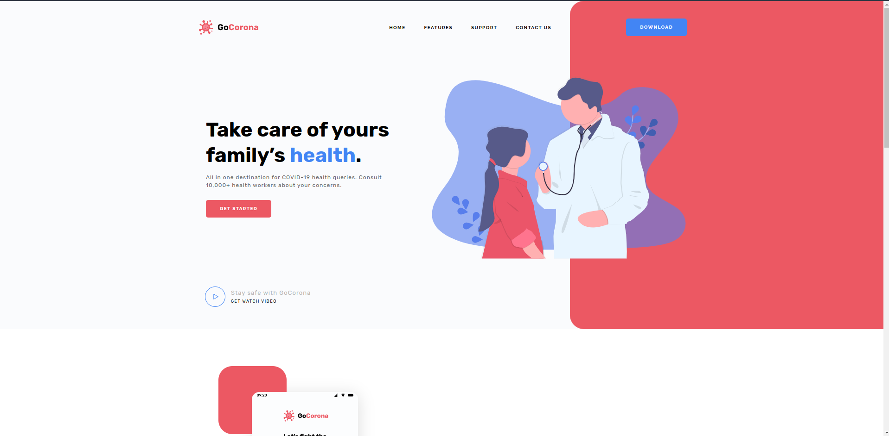
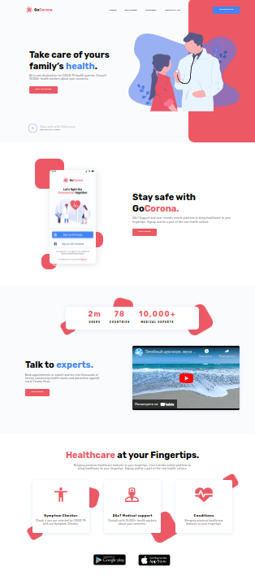

<h2 align="center">
  Цей проєкт було розроблено за допомогою ютуб-каналу "Фрілансер по життю".
</h2>

  Проєкт було розроблено , як практичний 
  приклад верстання по методології БЕМ, а також адаптивність сайту.

<h3>Результат</h3>

